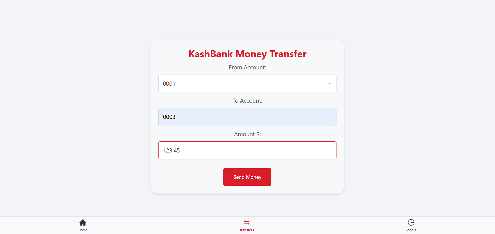

# Banking App

## Overview

This project is a banking application designed to mimic traditional banking apps, allowing users to manage their accounts, view transaction history, and send e-transfers between different user accounts. Built with a modern tech stack, this application provides a secure and user-friendly interface for handling financial transactions.

## Features

- User signup and authentication
- View account balance and transaction history
- Send and receive e-transfers between user accounts
- Responsive design suitable for desktop and mobile devices
- Dynamic transaction list with real-time updates
- Error handling for transaction failures and API calls

## Tech Stack

- **Frontend:** React, Bootstrap
- **Backend:** ASP.NET Core
- **Database:** PostgreSQL
- **API:** RESTful API for communication between frontend and backend

## Installation

### Prerequisites

- [.NET SDK](https://dotnet.microsoft.com/download) (version X.X.X)
- [Node.js](https://nodejs.org/) (version X.X.X)
- [PostgreSQL](https://www.postgresql.org/download/) (version X.X.X)

### Setup

1. Clone the repository:
   ```bash
   git clone <repository-url>
   cd banking-app
2. Install the backend dependencies:
  ```bash
  cd backend
  dotnet restore
  ```
3. Set up the PostgreSQL database:

Create a new PostgreSQL database.
Update the connection string in appsettings.json with your database credentials.
Run the database migrations to set up the schema
  ```bash
  dotnet ef database update
```
4. Install the frontend dependencies:

```bash
cd frontend
npm install
```
5. Start the backend server:

```bash
cd backend
dotnet run
```
6. Start the frontend development server:
```bash
cd frontend
npm start
```
7. Usage
Navigate to the application in your browser (usually at http://localhost:3000 for the frontend).
Sign up for a new account using the signup functionality.
Once logged in, you can view your account balance, transaction history, and send e-transfers to other users.
Contributing
Contributions are welcome! If you have suggestions for improvements or want to report issues, please open an issue or submit a pull request.

License
This project is licensed under the MIT License - see the LICENSE file for details



